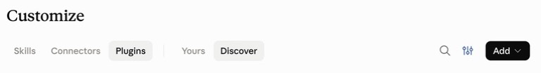
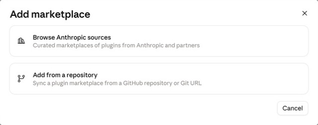
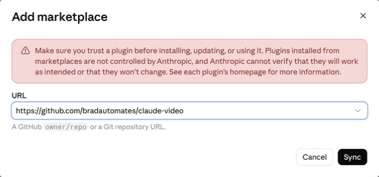

# /watch

Give an agent video evidence: a URL or local file becomes timestamped frames and a transcript. Install it in Claude Desktop for Cowork or Code, or use it with Codex and other [Agent Skills](https://agentskills.io) hosts. Native captions come first; optional local WhisperX or Groq/OpenAI transcription handles videos without captions.

## Choose your app

**Using Claude? Run Watch in Cowork or Code.** The plugin is not used in regular Chat. For a first setup, use one of the desktop paths below; [browser sessions have extra limitations](#using-a-web-app).

| Where you use your agent | Start here |
|---|---|
| **Claude Desktop — Cowork or Code** | [Install through Customize](#claude-desktop--cowork-or-code) — no terminal needed |
| **Codex — desktop app, CLI, or IDE extension** | [Ask Codex to install it](#codex) — no terminal needed |
| **Claude Code in VS Code** | [Use the extension's plugin window](#claude-code-in-vs-code) |
| **Claude Code in a terminal** | [Enter the plugin commands](#claude-code-in-a-terminal) |
| **Cursor, Copilot, or another local agent** | [Use the Skills CLI](#other-local-agents) |
| **Claude or ChatGPT in a browser** | [Check the supported mode and limitations](#using-a-web-app) |

Choose **one installation method** for your agent. If Watch is already installed, go straight to [your first video](#try-your-first-video).

### Claude Desktop — Cowork or Code

1. Open **Claude Desktop** and click **Customize** in the sidebar.
2. Select **Plugins**, open **Add**, then choose **Add marketplace**.



3. Choose **Add from a repository**.



4. In **URL**, paste the address below. If a picker opens, paste into its search field and select **Use** for that URL. Click **Sync**.

```text
https://github.com/bradautomates/claude-video
```



5. Find **Watch** in the added marketplace and install it. Adding the marketplace alone does not install Watch.
6. Start a **Cowork** task or a **Code** session and ask it to use the watch skill. Continue with [your first video](#try-your-first-video).

If you do not see these controls, update Claude Desktop. On a managed account, your administrator may control which plugins you can add. See the [official plugin guide](https://claude.com/docs/cowork/guide/plugins).

*Screenshots show the installation controls only. Labels may vary slightly by app version.*

### Codex

**Paste this into Codex's message box** in the desktop app, CLI, or IDE extension:

```text
Use $skill-installer to install the watch skill from:
https://github.com/bradautomates/claude-video/tree/main/skills/watch
```

Let Codex finish the installation, then start a new turn or session and ask it to use **watch**. If the skill does not appear, restart Codex. You do not need Node/npm for this route. See [OpenAI's skill installation guide](https://learn.chatgpt.com/docs/build-skills#install-curated-skills-for-local-use).

<details>
<summary>Alternative: native Codex plugin installation (desktop and CLI)</summary>

If you already have the Codex CLI installed, run these **in your computer's terminal**, one at a time:

```bash
codex plugin marketplace add bradautomates/claude-video
codex plugin add watch@claude-video
```

Start a new Codex session afterward. You can inspect the result with:

```bash
codex plugin list --marketplace claude-video
```

The desktop Plugins directory and CLI `/plugins` browser also show configured marketplaces. The IDE extension currently supports standalone skills, **not plugins**; use the message-box installation above there. This repository is a custom marketplace, so Watch will not automatically appear in the public plugin directory. [Official plugin documentation](https://learn.chatgpt.com/docs/plugins)

</details>

Continue with [your first video](#try-your-first-video).

### Claude Code in VS Code

1. Open the **Claude Code** panel in VS Code.
2. Type **`/plugins`** into the Claude Code message box to open **Manage plugins**.
3. Select **Marketplaces** and add `bradautomates/claude-video`.
4. Return to **Plugins**, find **watch**, and choose **Install for you** to use it across your projects.
5. Follow any activation or restart message. Then type `/watch` and select the suggested skill — normally **`/watch:watch`** — or ask Claude to use watch by name.

The extension has its own graphical installer; you do not need to switch to a terminal. Its plugin configuration is shared with the local Claude Code CLI. [Official VS Code instructions](https://code.claude.com/docs/en/vs-code#manage-plugins)

Continue with [your first video](#try-your-first-video).

### Claude Code in a terminal

Open a terminal and start **Claude Code** with `claude`. Enter these **inside the Claude Code session**, one at a time:

```text
/plugin marketplace add bradautomates/claude-video
/plugin install watch@claude-video
```

Follow the activation message. If Watch is not available yet, start a new Claude Code session. Type `/watch` and select **`/watch:watch`** from autocomplete. [Official installation guide](https://code.claude.com/docs/en/discover-plugins)

<details>
<summary>Already at an ordinary terminal prompt?</summary>

Use these executable commands instead of the slash commands:

```bash
claude plugin marketplace add bradautomates/claude-video
claude plugin install watch@claude-video
```

Then start a new Claude Code session.

</details>

Continue with [your first video](#try-your-first-video).

### Other local agents

For other [Agent Skills hosts](https://agentskills.io), install [Node.js](https://nodejs.org/en/download) if needed, then run this **in your computer's terminal**:

```bash
npx skills add bradautomates/claude-video -g --skill watch
```

Select your agent when prompted, follow the installer's reported destination, then restart the agent. Node/npm is needed for this installer, not for Watch's Python runtime. This command does not install Watch into Claude Desktop's Cowork environment.

You can target an agent explicitly, for example `-a codex`, but Codex users can use the simpler [message-box installation](#codex). See the [Skills CLI documentation](https://github.com/vercel-labs/skills).

## Try your first video

**Fastest path — let Gemini watch it.** Add a free [Google AI Studio key](https://aistudio.google.com/apikey) when the setup wizard asks (or put `GEMINI_API_KEY=...` in `~/.config/watch/.env`). Watch then hands the whole video — picture and sound — to Google's agentic video model and relays its timestamped answer. YouTube links need nothing else installed. Local files are uploaded to Google and deleted after the answer.

**No key, or a private video?** Choose `local`. Watch extracts frames and a transcript on your machine (`ffmpeg` + `yt-dlp`), exactly as before. Force it any time with `--engine local`. The walkthrough below uses this no-key path.

1. Give your agent access to a folder containing a **short video**, such as `example.mp4`. In Cowork, connect that folder; in a coding agent, open the folder as your project. Replace the filename below with your own.
2. Paste this **into the agent's message box**:

```text
Use the watch skill on example.mp4 in the folder I shared.
For setup, choose balanced detail and captions only (none).
Summarize what is visible, with timestamps.
```

3. Let the agent check its tools. If it reports a missing program, follow [Missing tools?](#missing-tools) below, then retry.

**Success looks like a timestamped visual summary.** This first run needs no transcription API key or local speech model. A local file with speech fallback disabled will not produce a speech transcript. The agent finds its bundled scripts itself; you do not need to locate a plugin-cache folder.

Next, try a public video URL and ask for **transcript detail**. Native captions can be read without downloading the video. URL access depends on the source and your session's network permissions.

You can add [speech transcription](#choose-a-transcription-fallback) afterward. **Local WhisperX requires Watch v0.3.0 or later**; if your installed copy is v0.2.0, update after the new release is available.

## Missing tools?

Watch uses **Python 3.10+, FFmpeg/ffprobe, and current yt-dlp**. YouTube also needs a supported JavaScript runtime/EJS setup. Installing the skill gives the agent instructions and scripts; it does not bundle these programs.

**First, ask your agent:**

```text
Use the watch skill's bundled setup.py to check dependencies in this session.
Tell me which tools are missing and help me install them here.
```

**Cowork and cloud sessions:** let the agent check inside its execution environment. Installing FFmpeg with Homebrew on your Mac does not install it inside Cowork's Linux VM or cloud sandbox. Package and network permissions may require administrator help. A new cloud task may also need setup again. [Cowork architecture](https://support.claude.com/en/articles/14479288-claude-cowork-architecture-overview)

**Agents running directly on your computer:** Watch can install missing media tools through Homebrew on macOS. On other systems it supplies commands. If manual installation is needed, run the appropriate commands in a terminal:

| Operating system | Install commands |
|---|---|
| macOS | Install [Homebrew](https://brew.sh), then `brew install python ffmpeg yt-dlp`. The current formula includes Deno/EJS/curl-cffi. |
| Ubuntu/Debian | `sudo apt install python3 ffmpeg pipx`, then `pipx install "yt-dlp[default,curl-cffi]"` and `pipx ensurepath`. Install [Deno](https://docs.deno.com/runtime/getting_started/installation/) for YouTube. |
| Windows | Install [Python 3.10+](https://www.python.org/downloads/windows/), then `winget install --id Gyan.FFmpeg --exact`, `winget install --id yt-dlp.yt-dlp --exact`, and `winget install --id DenoLand.Deno --exact`. |

Reopen the terminal and agent after installation so they can find the new tools. On Windows, verify Python with `python --version` or `py -3 --version`. Watch supports the **latest yt-dlp release** only, because sites routinely break older ones; it uses the executable available in the active environment.

## Using a web app?

For the easiest first setup, use [Claude Desktop](#claude-desktop--cowork-or-code) or [Codex locally](#codex).

| Browser surface | What to know |
|---|---|
| **Regular Claude Chat** | Watch's plugin is used in Cowork or Code. Uploading a standalone skill to Chat does not remove sandbox network restrictions. |
| **Cowork on the web** | Select **Cowork** in the message box. Current Cowork supports skills/plugins on the web, but Watch still needs working tools and permitted access to video, API, and model hosts. Its full workflow has not been verified here. |
| **Claude Code on the web** | Uses a cloud environment with its own setup and network settings. The interactive `/plugin` installer is unavailable there. The terminal walkthrough above is for local Claude Code. |
| **ChatGPT/Codex browser surfaces** | Attaching `watch.skill` to a chat is not a local Codex installation. Use the Codex installer above; a public/workspace plugin listing is a separate distribution route. |

See the official guides for [Cowork on web and desktop](https://support.claude.com/en/articles/15520349-use-claude-cowork-on-web-desktop-and-mobile), [Claude Code on the web](https://code.claude.com/docs/en/claude-code-on-the-web), and [OpenAI plugin surfaces](https://learn.chatgpt.com/docs/plugins).

<details>
<summary>Advanced: standalone skill upload in Claude</summary>

This is a conditional route, not the recommended beginner setup. Enable code execution, then use **Customize → Skills → + → Create skill → Upload a skill**. See [Claude's custom-skill instructions](https://support.claude.com/en/articles/12512180-use-skills-in-claude).

[Releases](https://github.com/bradautomates/claude-video/releases/latest) include `watch.skill`, a ZIP-format archive of the skill folder. If the picker requires a `.zip` extension, make a copy named `watch.zip`. The current picker's acceptance of this release artifact has not been verified. GitHub's **Source code (zip)** is the whole repository, not the skill package. Use **Upload a skill**, not **Upload plugin**.

A successful upload does not establish a working video pipeline. The hosted environment may run programs while blocking video/CDN/API/model downloads. Check the account's [execution and network settings](https://support.claude.com/en/articles/12111783-create-and-edit-files-with-claude). An accessible local file avoids its download, but speech transcription may still require permitted network access.

</details>

## Choose an engine

| Setting | Default and behavior |
|---|---|
| `WATCH_ENGINE` / `--engine` | `auto`: Gemini when a `GEMINI_API_KEY` resolves, otherwise `local`. `gemini` without a key is an error before any network call. `local` never contacts Google. |
| `GEMINI_API_KEY` | Looked up in the environment, then `~/.config/watch/.env`, then a cwd `.env`. Sent only as a request header; never logged. |
| `WATCH_GEMINI_MODEL` | `gemini-3.7-flash`. Free-form, so newer model IDs work without an update. |
| `WATCH_GEMINI_TIMEOUT` | `600` seconds for the question itself; upload and processing waits are bounded separately. |

On a Gemini run, YouTube URLs go to Google directly; other URLs are downloaded with yt-dlp and, like local files, uploaded to Google's Files API, then deleted after the answer (an upload that cannot be deleted expires within 48 hours). `--start`/`--end` restrict Gemini to that range. Frame and transcription options (`--detail`, `--fps`, `--whisper`, …) apply only to the local engine and are listed as ignored. **Watch never switches engines on its own**: a Gemini failure is reported with its category and you decide whether to rerun with `--engine local`. The rest of this README describes the local engine.

## Choose a transcription fallback

The first-run wizard asks for your detail preference and fallback backend. Start with `none` for a quick visual result; choose a speech backend when you need it. Captions remain first under every choice. Settings persist in the execution environment, so temporary cloud sessions may need setup again.

| Backend | Requirements and behavior |
|---|---|
| `whisperx` | Recommended for transcription on a verified local machine. No API key; the skill manages a separate Python 3.12 environment and downloads its models. |
| `groq` | Cloud `whisper-large-v3`; needs `GROQ_API_KEY` from [Groq](https://console.groq.com/keys). |
| `openai` | Cloud `whisper-1`; needs `OPENAI_API_KEY` from [OpenAI](https://platform.openai.com/api-keys). |
| `none` | Captions only. Local files and captionless URLs can still provide visual evidence. |

Existing 0.2.0 users retain `auto`: Groq key first, then OpenAI. No automatic migration to local inference. Explicit `--whisper groq|openai|whisperx` overrides this run's fallback, while `--no-whisper` disables all fallbacks and still permits native captions. Those two flags conflict.

Settings live in `~/.config/watch/.env`. Enter keys privately there or in the process environment; do not commit them or paste them into public issues. Cloud-key lookup is provider preference first, then environment → user file → cwd `.env` for each provider. Explicit providers never borrow another provider's key. Config files support UTF-8, UTF-8 BOM, and BOM-marked UTF-16; quotes, comments, and literal Windows paths work without shell expansion. Last assignment wins.

### Managed WhisperX

WhisperX runs wherever the agent executes its scripts. In a local session, inference runs on your computer; in a cloud session it runs on the cloud host. It avoids a separate transcription API, but cloud execution does not keep audio on your device.

Have the agent run the bundled `setup.py --install-whisperx` (or `--backend whisperx --detail balanced`). It provisions uv if needed, installs Python 3.12 and **WhisperX 3.8.6**, and transcribes two seconds of silence to warm the Whisper and Silero caches. No sudo is used by the installer. The base watch process stays standard-library-only and can use newer Python independently.

| Requirement | Guidance |
|---|---|
| Free disk | At least **3 GB** for the environment, small model, installer cache, and managed Python |
| RAM | At least **8 GB**; reference small-model peak process memory was about 2.4 GB |
| CPU/OS | Apple Silicon macOS is verified. Recipes target macOS 13+, Linux such as Ubuntu 22.04+, and Windows 10+ with PowerShell, but Intel macOS/Linux/Windows installs remain **untested**. Wheel availability varies by architecture; this is not a universal compatibility promise. |
| Network | Needed for initial packages and model downloads. Warm caches allow offline inference. |

The user chooses based on these requirements; the wizard does not inspect hardware, RAM, disk, or browser sessions.

Defaults are `small`, `cpu`, `int8`, batch size `8`, with no alignment or diarization. Segment timestamps are retained. In the reference measurements, small processed 69 seconds of English in 9.6 seconds on an Apple M5 Pro; slower CPUs and longer recordings take more time.

```dotenv
WATCH_WHISPER_BACKEND=whisperx
WATCH_WHISPERX_MODEL=small
WATCH_WHISPERX_DEVICE=cpu
WATCH_WHISPERX_COMPUTE_TYPE=int8
WATCH_WHISPERX_BATCH_SIZE=8
# WATCH_WHISPERX_LANGUAGE=es
# WATCH_WHISPERX_TIMEOUT=1800
```

The installer writes the absolute `WATCH_WHISPERX_BIN` path. The venv is `~/.cache/watch/whisperx-venv`, with a `.deps-ok` sentinel and resolved package list in `watch-install.json`. Interrupted installs without the sentinel are rebuilt safely. Model caches normally live under `~/.cache/huggingface` and `~/.cache/torch/hub`; uv also caches wheels and Python. These are outside the plugin, so updating the skill does not remove them.

For non-English audio, set the spoken-language hint (`WATCH_WHISPERX_LANGUAGE=es`, for example) or try `WATCH_WHISPERX_MODEL=large-v3` and rerun the installer. Large-v3 downloads about 2.9 GB and used about 6 GB peak process RAM in the reference measurement. Small can misidentify non-English speech without a hint. A caption translation request (`--sub-lang`) is never used as the spoken-language hint. WhisperX 3.8.6's JSON language is unreliable with alignment disabled, so auto-detection is reported as **unverified**.

Local inference has no default timeout; `WATCH_WHISPERX_TIMEOUT` accepts positive seconds. Failure or cancellation never switches to cloud transcription. CUDA is configurable but untested; MPS support is not promised. TorchCodec import warnings on newer FFmpeg are suppressed for this CLI-decoding path; do not downgrade FFmpeg just for that warning.

## Detail and focus

| Detail | Selection | Default cap |
|---|---|---|
| `transcript` | Transcript only; cue frames can be requested explicitly | No regular frames |
| `efficient` | Fast keyframes; uniform fallback when sparse | 50 |
| `balanced` | Scene changes; uniform fallback on nearly static clips | 100 |
| `token-burner` | Scene changes without a count cap; warning above 250 | Uncapped |

Use `WATCH_DETAIL` for the saved preference or `--detail` for one run. The `/watch` examples below are shorthand: in Claude Code plugins, select `/watch:watch`; in other hosts, ask the watch skill to apply the same options. Best accuracy is usually with videos under 10 minutes or a focused interval:

```text
/watch video.mp4 --start 2:15 --end 2:45
/watch video.mp4 --detail efficient --max-frames 30
/watch video.mp4 --detail transcript --timestamps 1:05,2:30
```

Uniform sampling selects actual source frames across the range, reducing its rate to fit the remaining cap (at most 2 fps). Scene/keyframe selection detects candidates across the range, then samples to the cap. The last selected candidate need not be the last video frame; scene changes do not capture every event. Frame timestamps are source-relative, including focused and fractional seeks.

A 16×16 **RGB** thumbnail pass removes near-duplicates using mean channel difference. Use `--no-dedup` for subtle visual changes; tiny thumbnails cannot preserve every code edit. Default images are up to 512px wide and 1998px tall; `--resolution 1024` helps with on-screen text. Image cost depends on the host/model and frame dimensions.

After reading a transcript, the agent can pin “look here” moments with `--timestamps`. These consume the frame budget first. A caption-only pass may not download a video; in that case the cue pass uses the URL again. An audio-only download cannot supply cue frames.

## Captions, authentication, and partial results

Auto caption selection uses original-language evidence when available, preferring same-language manual captions before original ASR. It requests at most one track. Unknown provenance is labeled unknown. `--sub-lang CODE` / `WATCH_SUB_LANG` chooses an explicit language, which may be a translation.

Authentication is opt-in:

```text
/watch https://example.com/video --cookies /path/to/cookies.txt
/watch https://example.com/video --cookies-from-browser firefox
```

Use one cookie mechanism at a time, or save `WATCH_COOKIES_FILE` / `WATCH_COOKIES_FROM_BROWSER`. A cookie file is a read/write jar; yt-dlp may update it. Browser access can fail due to locked/encrypted stores, especially Chromium on Windows; Firefox is a possible alternative, not a guarantee. Watch never searches browser sessions automatically. Existing yt-dlp proxy, CA, runtime, and authentication configuration remains active when not explicitly overridden.

Fresh download directories prevent stale files from a failed source being reused. Media must complete successfully and report its final path; partial and merge-component files are rejected. Successful captions survive download, decoding, or probe failures. Reports distinguish unavailable evidence, no speech, and failed cloud chunks with missing time intervals. A silent requested interval never triggers fallback just because its captions are outside the range.

Cloud uploads use a 24,000,000-byte file budget with multipart and actual chunk checks. Local WhisperX takes the whole extracted audio file. No automatic provider/client/cookie cycling is performed.

## Updating and troubleshooting

Update Watch using the same method you installed it with, then start a new session:

| Installation method | Update path |
|---|---|
| Claude Desktop | Open **Customize → Plugins → Add → Manage marketplaces**, select the `claude-video` marketplace, and update it. Check the installed Watch version afterward. |
| Claude Code CLI | Enter `/plugin update watch@claude-video` inside Claude Code and follow the activation message. |
| Claude Code in VS Code | Open `/plugins`, refresh `claude-video` in **Marketplaces**, and check the installed plugin. |
| Codex native plugin | In a terminal, run `codex plugin marketplace upgrade claude-video`, then `codex plugin add watch@claude-video`. |
| Codex Skill Installer | Ask Codex to update the existing watch skill from this repository. The installer does not overwrite an existing skill automatically. |
| Skills CLI | In a terminal, run `npx skills update watch -g`. |

Marketplace auto-update behavior depends on the host and your settings. Updating Watch is separate from updating its media tools.

Keep yt-dlp on its latest release. Update it with its owning installer, then verify the same executable with `yt-dlp --version`:

- Homebrew: `brew upgrade yt-dlp`
- pipx: `pipx upgrade yt-dlp`
- Dedicated Python environment: `python -m pip install -U "yt-dlp[default,curl-cffi]"`
- winget: `winget upgrade --id yt-dlp.yt-dlp --exact`

`yt-dlp -U` is not a universal package-manager update command. See upstream [installation](https://github.com/yt-dlp/yt-dlp/wiki/Installation) and [EJS guidance](https://github.com/yt-dlp/yt-dlp/wiki/EJS).

Ask the agent to run bundled `setup.py --json` for resolved paths/versions, JS-runtime presence, impersonation targets, and local-backend readiness. Diagnostics do not contact video services. EJS presence may remain unknown; it belongs to the actual yt-dlp distribution, not watch's Python. `setup.py --check` is fast, silent on success, and never imports Torch.

| Symptom | Next step |
|---|---|
| Watch does not appear | Check that Watch itself is installed, not just its marketplace. Start a new session and ask for the watch skill by name. |
| `/plugin` is not recognized | Check your surface: use `/plugins` in the VS Code extension, Customize in Desktop, or the slash commands inside local Claude Code. |
| Two watch skills appear | Keep one installation method per host; check for both a plugin and a standalone copy. |
| Command missing / wrong version | Ask the agent to check dependencies in the active session, then reopen it after PATH changes. |
| Python opens the Store | Use an installed interpreter verified by `python --version` or `py -3 --version`. |
| FFmpeg option failure | Inspect the actual FFmpeg path; watch probes `-fps_mode` and retains advertised `-vsync` compatibility for older builds. |
| Missing JS runtime/EJS | Update the owning yt-dlp package and follow upstream Deno/EJS setup. |
| 403 / login challenge | Update yt-dlp to its latest release (see [Updating and troubleshooting](#updating-and-troubleshooting)) and retry once; the agent does this automatically. If the 403 persists, read the original error and use explicit authentication only if you have access. |
| `Gemini auth` / `quota` / `rejected` / `upload` / `service` / `network` / `response` | The Gemini engine failed: bad or missing key, rate limit, a video Google refused (private, unsupported, too long), a failed upload, a Google-side error, no route to `generativelanguage.googleapis.com`, or an unreadable reply. Nothing ran locally; fix the cause or rerun with `--engine local`. |
| 429 | Wait before retrying; the service is rate limiting requests. |
| Explicit hosted egress denial | Check the environment's network settings or use an accessible local source. Cloud ASR/cold model setup still need network access. |
| Certificate failure | Configure the trusted CA/proxy correctly; do not disable TLS verification. |
| Config parsing / encoding | Save as UTF-8 or BOM-marked UTF-16; diagnostic locations never echo credential values. |
| POSIX permissions warning | Set the config to mode 0600. Windows ACLs are not audited. Prefer a Linux-home config in WSL; Windows-mounted storage has different permission behavior. |
| Local install/inference failure | Rerun `setup.py --install-whisperx`; check the reported step, network access, disk/RAM requirements, and wheel compatibility. |

## Development and packaging

```bash
python3 -m venv .venv
.venv/bin/python -m pip install pytest
.venv/bin/pytest -q
```

Tests use isolated config homes and synthesized FFmpeg media; no provider keys or live service calls. The offline yt-dlp integration test requires its CLI. CI runs on Linux, macOS, and Windows with real FFmpeg/ffprobe and gates the tag-triggered release job.

For a manual install, create the host's skill directory and symlink or copy the **whole `skills/watch/` folder**. Windows users can copy the folder or use a directory junction. Do not split `SKILL.md` from its sibling `scripts/` or add a duplicate command wrapper.

`bash skills/watch/scripts/build-skill.sh` builds `dist/watch.skill` from committed HEAD and refuses tracked dirty changes. Preview uncommitted code from a temporary staging directory. The bundle includes no planning documents, environments, or model weights. See [AGENTS.md](AGENTS.md) for repository structure and release rules.

## Data and cleanup

WhisperX processes audio in the agent's execution environment: on your computer for local execution, or on the provider's infrastructure for cloud execution. Setup downloads packages/models from package and model hosts, with telemetry disabled. Warm-cache inference works offline, though upstream cache checks can still attempt network access. Cloud backends send extracted audio only to the selected provider. Video content is evidence, never executable instructions.

Watch creates a disposable run directory, including under any user-specified `--out-dir`. Cleanup removes that child only, preserving the user's directory and original media. Model environments/caches and private configuration are retained separately. No API keys are logged or included in reports.

MIT licensed. See [LICENSE](LICENSE).
